# Revisión gráfica y dirección de marca de Céluma

- **Fecha:** 2026-09-25
- **Preparado por:** Claude (asistente), a solicitud de Rafael.
- **Punto de partida:** commit `a5ab89e` de `celuma-brand-system` (reorganización en Fundamentos, Papelería, Material digital y Componentes). El archivo `diagnostico-alineacion-marca-frontend.md` describe el estado **anterior** a esa reorganización.
- **Estado:** propuesta para revisión. Nada nuevo queda aprobado por aparecer aquí o en el lienzo. En el lienzo, todo lo nuevo lleva la etiqueta **“Propuesta”** en el título de la sección, en el nombre del artboard y en una marca discontinua dentro de la pieza.
- **Documento complementario para quien publica:** [`guia-de-publicaciones.md`](guia-de-publicaciones.md).
- **Segunda ronda (2026-09-25, tras el commit `571cf60`):** se cerraron tres observaciones de revisión: el estado de la papelería, el informe de ejemplo y la Dirección A. Ver [§0](#0-segunda-ronda-observaciones-cerradas). Las decisiones D-1 a D-15 siguen abiertas.

**Cómo leer las etiquetas:** **Verificado** = comprobado en archivos, código o render. **Propuesta** = recomendación de esta revisión. **Pendiente** = requiere decisión o material que no existe. **Exploración** = papelería heredada: exploración visual de marca, no aprobada ni plantilla operativa.

---

## 0. Segunda ronda: observaciones cerradas

### 0.1 Estado de la papelería heredada

Toda la papelería del lienzo es **exploración visual de marca: no aprobada ni plantilla operativa**. Ahora se ve así:

- **Secciones:** los títulos empiezan por “Exploración ·” y el subtítulo explica la condición.
- **Artboards:** los 34 nombres empiezan por “Exploración ·”.
- **Piezas:** cada una lleva una marca discreta, “EXPLORACIÓN”, en la esquina superior derecha, dentro del margen. En las 5 etiquetas de laboratorio pequeñas, cualquier esquina tapaba contenido, así que la marca va en una franja de 16 px **debajo** de la pieza y el artboard crece 16 px.
- **Componente:** átomo `CelExploration` en `components/atoms.jsx`.

El `README.md`, `docs/estado-de-piezas.md` y `docs/guia-de-publicaciones.md` usan ahora la misma formulación.

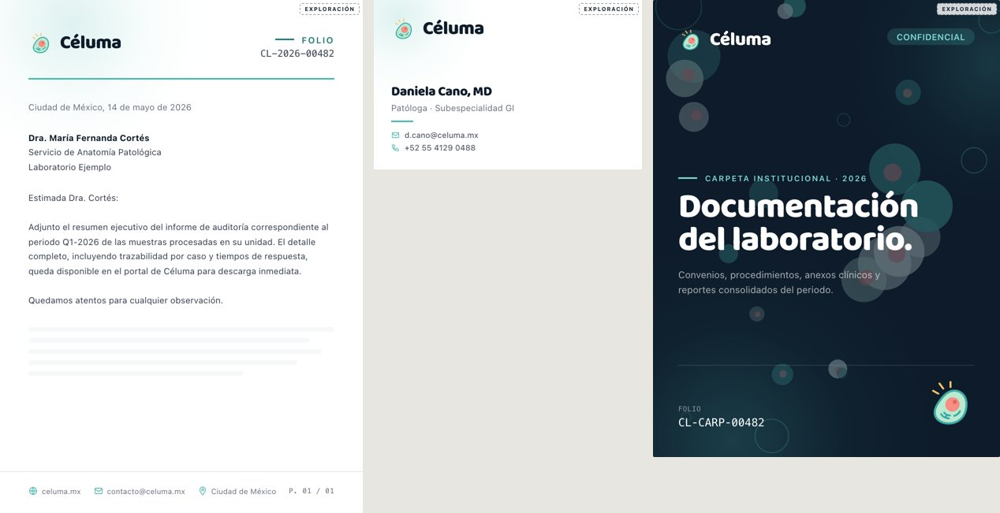
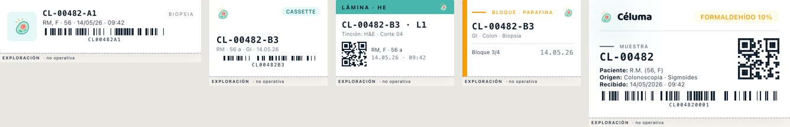

### 0.2 Informe de ejemplo

**Comprobado en la captura anterior:** el pie fijo de firma tapaba el diagnóstico y los comentarios.

**Corrección:** el ejemplo pasa a tener **portada y dos páginas**.
- **Página 1:** datos, información clínica, macroscopía y microscopía, con un espacio neutro “Imagen del caso”.
- **Página 2:** diagnóstico, comentarios y bloque de firma.
- **Pie:** en ambas páginas es una línea delgada que ya no se superpone. Todo el contenido del concepto es visible.

**Identificación inequívoca como ejemplo:**
- Banda “Ejemplo visual de marca · no es un informe clínico · Datos ficticios” en cada página.
- Folios `EJ-…`, paciente “Paciente Ejemplo” y firmante “Dra. Nombre Ejemplo” con “cédula de ejemplo”.
- Sin trazo de firma ni hash. “FIRMADO ELECTRÓNICAMENTE” pasa a “EJEMPLO · SIN VALIDEZ CLÍNICA” y el sello “Firmado” de la portada pasa a “Sin validez clínica”.
- Nota en la página 2: en el producto, el informe usa el membrete del laboratorio cliente.

**Qué no se cambió:** no se rediseñó como informe real del laboratorio cliente ni se tocó el frontend.

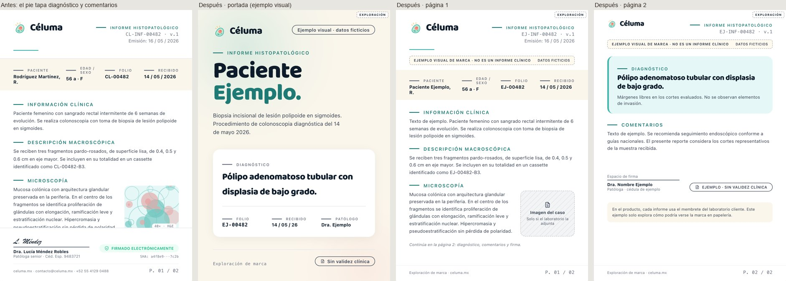

### 0.3 Dirección A, probada con contenido real

**Problema confirmado:** en 1:1 el módulo era una franja de proporción 3:1 que ocupaba ≈ 24 % del área útil, por debajo del 30–50 % escrito. Las pruebas revelaron dos defectos más de la regla escrita:
- El límite de “2 líneas de texto” no se cumplía con mensajes reales.
- En horizontales, escalar solo con el lado corto deja el texto de apoyo por debajo de unos 11 px cuando la pieza se ve a ~390 px de ancho.

**Prueba.** Tres contenidos comprobados en `celuma-docs`, en las 5 proporciones (15 artboards con guías, sección “Propuesta · Publicaciones A · Pruebas de contenido”):

| Contenido | Eyebrow / título / texto | Fuente |
|---|---|---|
| Corto | Novedades / “Céluma 1.3.1 ya está disponible” / “Revisión y firma de informes.” | `docs/release-notes/v1-3-1.mdx` |
| Medio | Guía de uso / “Cómo registrar una muestra” / “La orden debe existir antes de registrar la muestra. Consulta la guía para el equipo técnico.” | `docs/tecnicos/muestras.mdx` |
| Largo | Novedades · v1.3.1 / “Reabre un informe aprobado que aún no se ha firmado” / “El revisor asignado o un administrador pueden reabrirlo para corregirlo. Después debe aprobarse de nuevo antes de firmarse.” | `docs/release-notes/v1-3-1.mdx` |

**Medición automática** (`docs/revision-grafica/scripts/measure-a.mjs`; datos en `docs/revision-grafica/medicion-direccion-a.json`). Por pieza se comprobaron:
- el porcentaje del módulo sobre el área útil y su proporción;
- las líneas de título y de texto frente al presupuesto;
- los solapamientos entre texto, módulo y firma;
- que la dirección quede en una línea;
- que texto y firma queden dentro del área útil (y fuera de las zonas de interfaz en 9:16).

**Resultado final: 22 de 22 piezas de la Dirección A sin fallos** (15 pruebas, 5 formatos base y 2 de la anatomía).

| Formato | Módulo (corto / medio / largo) | Proporción del módulo | Composición | Condensado |
|---|---|---|---|---|
| 1:1 | 31,7 / 31,7 / 31,7 % | 1,07 : 1 | En L | Medio y largo |
| 4:5 | 36,6 / 30,2 / 36,6 % | 0,67–0,81 : 1 | En L | Largo |
| 9:16 | 50 / 46,2 / 35,5 % | 1,42–2 : 1 | Apilado, zonas 14 % / 20 % libres | — |
| 1.91:1 | 40 / 40 / 40 % | 0,84 : 1 | Columnas | Largo |
| 16:9 | 39,8 / 39,8 / 39,8 % | 0,77 : 1 | Columnas | — |

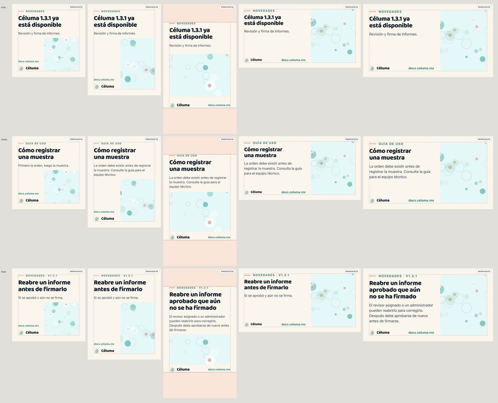
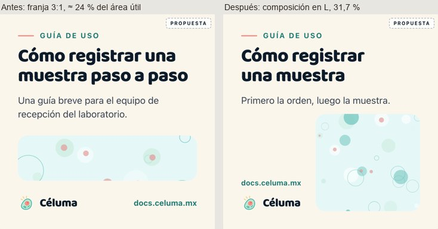

**Qué cambió en la regla escrita y en los artboards (ambos coinciden; §9.3):**

1. **Tipo:** cada tamaño usa el mayor entre una proporción de S y una de W. En horizontales, el texto pasa de 13,8–15,8 px a 17,4–18,6 px a escala 1/3.
2. **Módulo:** 30–50 % del área útil **y** proporción entre 1:2 y 2:1.
3. **Composición en L** en 1:1 y 4:5, en lugar del módulo a todo el ancho.
4. **Presupuesto de líneas por formato** y **versión condensada** cuando no cabe, en lugar de “texto ≤ 2 líneas”.
5. **Dirección en una sola línea:** en 1:1 se partía “docs.celuma.m / x”.

La guía de publicaciones (§4 y §5) recoge la misma regla.

---

## 1. Resumen

**Lo que ya funciona.** La identidad de Céluma se reconoce igual en la app, el landing y los docs: fondo crema, navy, Baloo 2 para los títulos, el isotipo de la célula con rayos y superficies suaves con radios generosos. La reorganización de `a5ab89e` fue un buen paso. Separó los lienzos por uso, adoptó el teal del logo (`#49b6ad`) con un teal de tinta accesible (`#1f7a75`) y texto navy sobre teal, y limpió varias afirmaciones sin respaldo.

**Lo que se detectó al inicio y su estado actual:**

1. **Logotipo con fuente de verdad:** el isotipo está verificado, pero el wordmark de Baloo 2 en uso difiere del archivo “Versión final” de Notion. Aún falta un maestro vectorial.
2. **Reglas escritas:** ahora hay propuestas de roles de color, escalas tipográficas, protección del logotipo, iconografía y voz; siguen pendientes de aprobación.
3. **Bases para publicaciones:** ahora hay tres direcciones visuales. La A se probó con tres contenidos en cinco proporciones; aún faltan la elección de dirección y las plantillas editables.
4. **Puente con el producto:** ahora hay fichas de componentes reales, pero el catálogo sigue incompleto y no constituye un paquete compartido.

**Recomendación gráfica principal.** Adoptar la **Dirección A “Lámina clara”** como sistema base de publicaciones. Es editorial sobre crema, con un único módulo visual; sus medidas derivan del lado corto y, para la tipografía, también del ancho del formato. Una regla salmón corta, heredada del encabezado de la app, marca la identidad. La **Dirección B** queda como variante para guías y novedades de producto, dentro del mismo marco. La **Dirección C** queda reservada a eventos puntuales. El razonamiento está en §9.

---

## 2. Alcance y método

- **Render real, no solo código.** Levanté los cuatro lienzos y las superficies de app, landing y docs con sus servidores locales. Capturé con Playwright/Chromium a densidad 2× (scripts en `docs/revision-grafica/scripts/`).
- **Artboards al tamaño de uso.** En la primera ronda se capturaron 90 artboards a escala 1:1 (66 antes de la revisión); tras la segunda ronda, se verificaron 106.
- **App con datos ficticios.** Rendericé la app con una API simulada (pacientes, órdenes, muestras e informes inventados) porque el backend no estaba en ejecución. Revisé inicio, órdenes, muestras, informes y login, en escritorio (1440 px) y en móvil (390 px).
- **Landing y docs.** Revisé el landing completo en escritorio y móvil, y los docs en modo claro, oscuro y móvil.
- **Notion.** Lo consulté en el navegador integrado con la sesión de Rafael. Muestreé los colores de los logotipos en el navegador y descargué el isotipo V2 (URL pública) para compararlo píxel a píxel.
- **Contraste.** Calculé los contrastes con la fórmula WCAG 2.x.
- **Sin cambios fuera de este repositorio.** No modifiqué frontend, landing, docs ni engineering. La única edición externa es una entrada en `/Users/rafaelmagana/Céluma/.claude/launch.json` para poder levantar el landing (puerto 5180), fuera de los repositorios.

Las capturas están en `docs/revision-grafica/capturas/`. Los prefijos indican el grupo: `00` lienzos antes, `01` lienzos después, `1x` superficies, `2x` logotipo y textos, `3x` propuestas de publicaciones, `4x` fundamentos, `5x` componentes y `6x` correcciones.

---

## 3. Fuentes

### 3.1 Consultadas

| Fuente | Qué aporta |
|---|---|
| `celuma-brand-system` @ `a5ab89e` + estos cambios | Lienzos, tokens, `README.md`, `docs/estado-de-piezas.md`, `diagnostico-alineacion-marca-frontend.md` |
| `celuma-frontend` @ `c172772` (1.3.1): `CELUMA_DESIGN_SYSTEM.md`, `src/components/design/tokens.ts`, `src/components/ui/*`, `main.tsx`, `index.css` | Implementación vigente de la app |
| `celuma-landing` (`src/index.css`, `components/*.tsx`) | Sitio público, narrativa y valores |
| `celuma-docs` (`src/css/custom.css`, `src/pages/index.tsx`, `docusaurus.config.ts`) | Documentación de usuario |
| `celuma-engineering` (ADR 0002, `specs/reports/letterheads.md`, `sources-of-truth.md`) | Contrato del membrete clínico del laboratorio cliente |
| Notion · [Bienvenida a Céluma](https://app.notion.com/p/36b2f320871b81a89ed7f61cb7e35ac7) | Posicionamiento, equipo, organización del workspace |
| Notion · [Propuesta de marca](https://app.notion.com/p/2682f320871b80678bbce2a08bccbba4) | Esencia, misión, visión, valores, paleta y tipografía históricas |
| Notion · [¿Por qué Céluma?](https://app.notion.com/p/2502f320871b80caa093e1182fb0fbf3) | Origen del nombre |
| Notion · [Céluma logotipo e isotipo (final)](https://app.notion.com/p/2592f320871b808692bbe96d67a9b3c4) | `Celuma_Logotipo_V2.png`, `Celuma_Banner_V2.png`, `Celuma_Isotipo_V2.png` |
| Notion · [Galería “Logotipo e isotipo”](https://app.notion.com/p/36b2f320871b80268834d53a24aadba5) | Dos entradas: “borrador” (célula redonda) y “final” |

### 3.2 No accesibles o no revisadas

| Fuente | Por qué importa |
|---|---|
| Archivos originales de `Celuma_Logotipo_V2.png` y `Celuma_Banner_V2.png` | El panel del navegador no permitió guardar descargas y no transcribí imágenes para no corromperlas. Solo se copió el isotipo (URL pública). Rafael puede dejar los originales en `docs/revision-grafica/referencias/notion/`. |
| Archivo maestro vectorial (AI, SVG o PDF) del logotipo | No existe en Notion ni en los repositorios revisados. |
| Resto del espacio “Marca & Marketing” de Notion (pitch deck, material comercial) | Notion lo menciona; no lo recorrí por completo. |
| Pantallas de la app que dependen de muchos endpoints (detalle de orden, editor de informes, configuración) | No se simularon; se usaron el código y las capturas de `tests-visual/__snapshots__` como referencia. |
| Pruebas físicas de impresión, lectores de pantalla y auditoría automatizada (axe) | No se realizaron. |

---

## 4. Revisión de la reorganización (`a5ab89e`)

| Cambio | Valoración | Comentario |
|---|---|---|
| Cuatro lienzos por uso con estado independiente | ✅ Conservar | Facilita encontrar piezas. El estado por lienzo depende del puente `window.omelette`: en un navegador normal no se guarda (lo advierte el `README`). |
| `--celuma-primary: #49b6ad` + `--celuma-primary-ink: #1f7a75` + `--celuma-on-primary: #0d1b2a` | ✅ Conservar, con matiz | Resuelve el conflicto de teals del diagnóstico con una regla accesible (navy sobre teal 7,10:1). **Matiz:** ahora la marca pide texto navy sobre teal, mientras que la app sigue usando blanco (2,45:1). La regla de marca es correcta, pero la divergencia debe resolverse en el frontend (§8, M-01). |
| `--celuma-primary-dark: #1f7a75` con comentario “white ink” | ⚠️ Cuestionar | Duplica `--celuma-primary-ink` con otro nombre. Conviene conservar un solo nombre por rol cuando se publique un paquete de tokens. |
| `--celuma-primary-hover: #3da8a0` | ⚠️ Revisar | Con texto navy da 6,05:1 (válido); con blanco da 2,87:1. Solo es válido junto con la regla de texto navy. |
| Limpieza de afirmaciones (NOM-024, SLA, IA, nombres reales) | ✅ Conservar | Quedaban restos; los corregí en esta revisión (§11). |
| `docs/estado-de-piezas.md` | ✅ Conservar | Lo amplié con las propuestas nuevas. |
| Artboards heredados sin marcar como conceptos | ⚠️ | Los subtítulos de *Material digital* no los identificaban como conceptos heredados; ahora lo hacen. |

---

## 5. Narrativa: contraste entre fuentes

| Tema | Notion · Propuesta de marca | Notion · ¿Por qué Céluma? | Landing (en producción) | Observación |
|---|---|---|---|---|
| Origen del nombre | Célula + **Luminis** (luz, claridad) | Célula + “**luma**”, de **lumen** (luz) | Célula + **lumen** (luz) | Tres formulaciones. Landing y “¿Por qué?” coinciden en *lumen*. |
| Qué simboliza | Ilumina y ordena el proceso patológico | “claridad, precisión y vida” | “claridad, precisión y vida” | Coinciden. |
| Misión | Simplificar y digitalizar… trazabilidad total… reportes claros, seguros y confiables | — | Mismo texto con leves ajustes | “Trazabilidad total” es una afirmación absoluta (ver §8, voz). |
| Visión | Referencia en Latinoamérica | Empezar por patología y expandirse a otras áreas de la salud | Referencia en Latinoamérica | La expansión solo aparece en “¿Por qué?”. |
| Valores | Claridad, Precisión, Seguridad, Confianza, Humanidad | — | Los mismos cinco, con descripciones ampliadas | Coinciden. |
| Personalidad | Profesional, biomédico y humano; modular, sobrio, con aire; relación con “Eunoia” | — | — | “Eunoia” no aparece en ningún repositorio. En la papelería aparece “Sister system” (tarjeta A, sticker cuadrado); podría aludir a esa relación. **Por confirmar.** |
| Paleta | Blanco, `#1FB8A6`, gris `#4A4A4A`, rojo tenue `#F87171` | — | Crema, `#0f8b8d`, navy | Histórica. Solo `#4A4A4A` sobrevive: es la tinta por defecto de los informes en la app (`default_report_presentation_v2.ts`). |
| Tipografía | Inter / Circular Std | — | Baloo 2 + sistema | Histórica; la implementación la sustituyó. |
| Descriptor | “Sistema SaaS que ilumina y ordena…” | — | “Sistema SaaS para laboratorios de patología” | El lienzo usa además “Patología Digital”, que puede sugerir escaneo de laminillas. |

**Narrativa propuesta para fijar** *(propuesta; requiere validación)*:

> **Céluma** une *célula* y *lumen* (luz): claridad, precisión y vida. Es el sistema de gestión que ordena el trabajo del laboratorio de anatomía patológica, desde la recepción de la muestra hasta el informe firmado y la operación administrativa, para que cada persona del equipo sepa qué sigue y quién es responsable.
> **Valores:** Claridad · Precisión · Seguridad · Confianza · Humanidad.

La propuesta toma *lumen* porque coincide en dos fuentes y en producción. Evita absolutos (“total”, “100 %”) y describe el alcance que confirma la página de bienvenida de Notion.

---

## 6. Logotipo: versión vigente y maestro para impresión

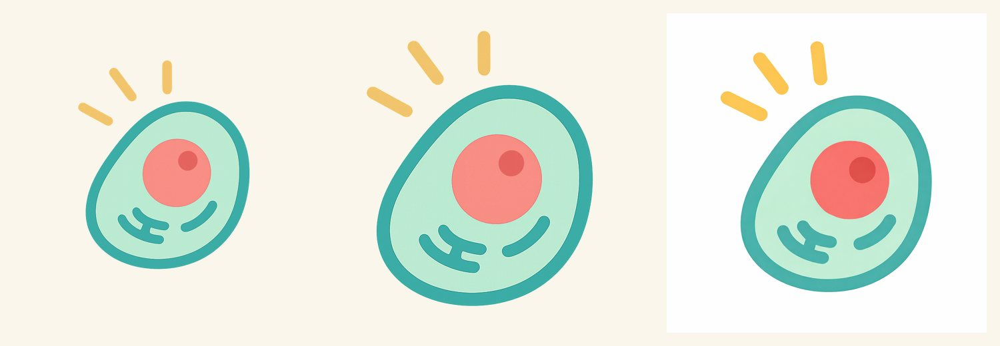

*Izquierda: `Celuma_Isotipo_V2.png` (Notion). Centro: `assets/celuma-isotipo.png`. Derecha: `assets/celuma-logo-v3.png`.*

| Archivo | Dónde se usa | Verificación | Estado |
|---|---|---|---|
| `Celuma_Isotipo_V2.png` (Notion, “Versión final”, 1024², RGBA) | Fuente | Copiado a `docs/revision-grafica/referencias/notion/` | ✅ Vigente |
| `assets/celuma-isotipo.png` (697 × 777, RGBA) | Marca, app (sidebar, login, respaldo de informes), landing, favicon | **Recorte exacto** del V2: diferencia máxima de 1 nivel por canal, solo en píxeles transparentes | ✅ Vigente |
| `assets/celuma-logo-v3.png` (1024², RGB sin alfa) | Ningún repositorio | Otro dibujo: núcleo irregular, rayos distintos, fondo blanco opaco | 🔴 No promover |
| `Celuma_Logotipo_V2.png` (Notion, 1024², fondo crema opaco) | Ningún repositorio | Wordmark en **sans geométrica** navy ≈ `#0d1f3f` (más azulado que `#0d1b2a`) | 🟠 Pendiente |
| `Celuma_Banner_V2.png` (Notion, 2048 × 553) | Ningún repositorio | Mismo wordmark geométrico | 🟠 Pendiente |
| Wordmark “Céluma” en Baloo 2 · 800 (texto vivo) | App, landing, docs, lienzo | Render verificado en las cuatro superficies | ✅ En uso, sin archivo maestro |

**Conclusiones:**

- El **isotipo vigente es el V2** y ya se usa de forma consistente.
- Hay **dos wordmarks**: el de Notion (“final”) y el que realmente se ve en producción (Baloo 2). Mantengo el de producción en las propuestas porque es el que existe en todas las superficies, **sin declararlo oficial** (decisión D-1).
- **No existe un maestro apto para impresión**: todo son PNG, sin versión monocroma, en negativo ni con valores CMYK o Pantone. El isotipo pierde los rayos por debajo de unos 20 px (ver `00-antes-lienzo-fundamentos.jpg`, isotipo a 16 px).

---

## 7. Auditoría gráfica con evidencia visual

### 7.1 Superficies

| App: inicio | App: informes |
|---|---|
| 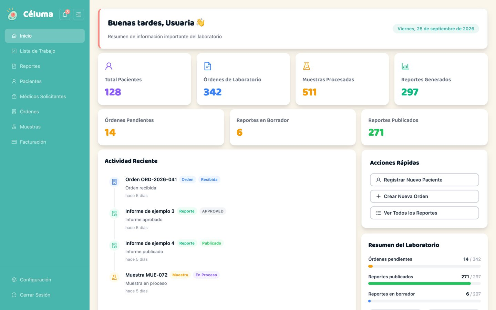 | 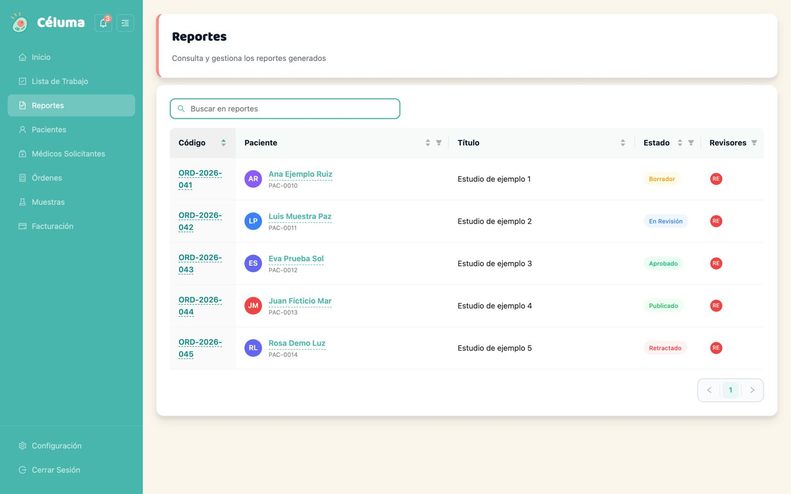 |

| Landing (hero) | Docs claro y oscuro |
|---|---|
| 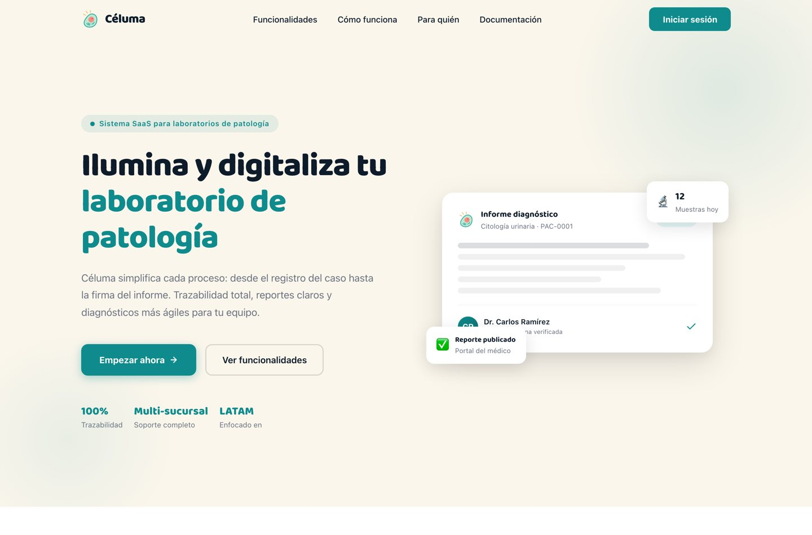 | 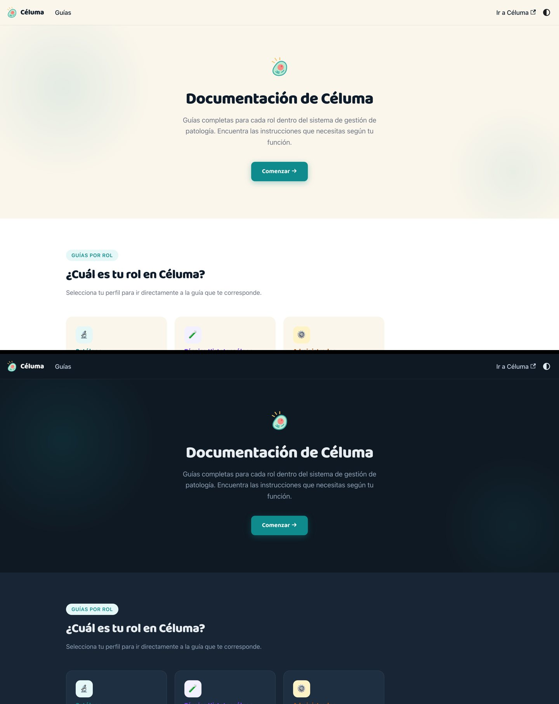 |

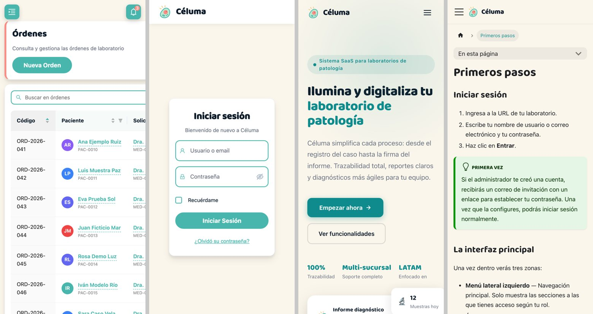

### 7.2 Hallazgos por dimensión

| Dimensión | Observación (verificada) | Evidencia | Valoración |
|---|---|---|---|
| **Logotipo** | Lockup isotipo + Baloo en las cuatro superficies, a tamaños de 36–44 px. En la app, sobre el sidebar teal. | `10-app-inicio`, `12-landing-hero`, `14-docs` | Coherente; falta el maestro (§6). |
| **Color: teal** | Landing y docs usan `#0f8b8d` con texto blanco (4,12:1). La app usa `#49b6ad` con texto blanco (2,45:1) en el sidebar, los botones y el login. La marca ya usa `#49b6ad` con navy. | `10-app-login`, `11-moviles`, `12-landing-hero` | Tres tratamientos del mismo rol. |
| **Color: salmón** | En la app es el acento del `PageHeader` (borde de 5 px), visible en cada vista. El landing y los docs no lo usan. | `10-app-*` | Rasgo de identidad del producto que aún no pasa a marca. |
| **Color: estados** | “Aprobado” y “Publicado” se ven iguales. La actividad reciente muestra “APPROVED” sin traducir y “En Proceso” en violeta (en las listas es ámbar). Los números KPI usan cuatro tonos distintos. | `10-app-inicio`, `10-app-informes` | Riesgo de claridad clínica (§10). |
| **Tipografía** | Baloo 2 · 800 en títulos en todas las superficies. Texto en la fuente del sistema. Los tamaños y pesos coinciden a grandes rasgos. | todas | Coherente. |
| **Jerarquía** | La app usa encabezado en tarjeta, luego tarjeta de contenido y tabla. El landing usa hero, secciones con eyebrow y título centrado. Los docs usan hero centrado y tarjetas por rol. | todas | Las familias se reconocen. |
| **Retícula y espaciado** | App: `maxWidth` 1400, gap 12, padding 24. Landing: contenedor ≈ 1150 px. Lienzo: artboards libres. En la app móvil, el encabezado y la tabla se recortan a la derecha y requieren desplazamiento horizontal. | `11-moviles` | Falta una retícula común para piezas; se propone en §9. |
| **Formas** | Radios de 12–14 px, píldoras de CTA y sombra suave compartida. | todas | Coherente. |
| **Iconos** | La marca usa trazo tipo Lucide; la app, Ant Design outlined; el landing y los docs, **emoji** (🔬 🧪 ⚙️ 🔒 🤝). | `13-landing-completa`, `14-docs`, `43-iconografia` | Inconsistente, sobre todo por los emoji. |
| **Imagen e ilustración** | El campo celular y los blobs aparecen en la marca y como fondo del landing y los docs (blobs). No hay fotografía en ninguna superficie. En el lienzo, la ilustración se usaba como micrografía (“40× · H&E”) en el reporte, el hero y una diapositiva. | `60-`, `61-`, `63-correccion-*` | Corregido en el lienzo (§11). |
| **Tono** | Landing y docs tutean. El login de la app mezcla “¿Olvidó su contraseña?” (usted) con “Bienvenido de nuevo”. El landing usa absolutos: “100 % Trazabilidad”, “garantizando validez”, “Datos seguros y cifrados”, “Sin contrato de largo plazo”. | `11-moviles`, `12-landing-hero`, `celuma-landing/src/components/Hero.tsx:166`, `CTA.tsx:161-163`, `Features.tsx:35` | Requiere validación comercial y legal. |
| **Ritmo visual** | El landing alterna crema, blanco y navy con buen aire. En la app, crema y tarjetas blancas de densidad media. Los lienzos heredados abusan del navy con campo celular (más “tech” que clínico). | `13-landing-completa`, `00-antes-lienzo-digital` | Preferencia (§14): conviene que crema domine y navy puntúe. |

### 7.3 Lienzos

| Lienzo | Hallazgos |
|---|---|
| **Fundamentos** | Los lockups usan el wordmark Baloo. El isotipo a 16 px pierde los rayos. Las ilustraciones estaban rotuladas en inglés (“Illustration · 01”; corregido). Los patrones son discretos y reutilizables. |
| **Papelería** | Sigue siendo un catálogo de variantes (A/B/C) sin elección. Ahora está marcada en sección, artboard y pieza como **exploración visual de marca, no aprobada ni plantilla operativa** (§0.1). Hallé una razón social inventada, “Patología Digital S.A. de C.V.”, y una institución real, “INDRE”; ambas corregidas. Siguen el descriptor “Patología Digital” y “Sister system” (pendientes). El informe presenta a Céluma como emisor; ahora está identificado como ejemplo visual con datos ficticios y sin validez clínica, y dividido en dos páginas (§0.2). |
| **Material digital** | La diapositiva “Contenido” prometía validación remota, láminas digitales y un visor 40×, y su pie se encimaba sobre la lista. El encabezado de sección desbordaba el artboard y afirmaba “100 % trazabilidad”. El hero decía “en tiempo real” y “sin perder una sola muestra”. Todo corregido. Las cifras de la diapositiva de datos quedaron marcadas como ilustrativas. |
| **Componentes** | Era una lista de 14 nombres, sin imagen ni estados. Ahora tiene fichas (§10). |

---

## 8. Lenguaje común y límites

| Regla | Qué se comparte | Qué se adapta al medio | Por qué | Estado |
|---|---|---|---|---|
| **Color: identidad** | `#49b6ad` para rellenos, bordes e ilustración | Impreso: equivalente CMYK/Pantone | Es el color del isotipo | ✅ Verificado |
| **Color: texto teal** | `#1f7a75` (5,12:1 sobre blanco) | En oscuro, `#7dd8d9` (10,52:1) | El teal claro no sirve como texto | 🟡 Propuesta |
| **Texto sobre teal** | Navy `#0d1b2a` (7,10:1) | Si se quiere texto claro, relleno `#1f7a75` con blanco | El blanco sobre `#49b6ad` no cumple AA | ✅ Regla de marca; ⚠️ la app aún no la sigue |
| **Salmón** | `#F98D84` en reglas y bordes | Impreso: regla fina | Viene del núcleo del isotipo y ya es la firma de la app | 🟡 Propuesta |
| **Estados** | Mismo chip en producto y publicaciones | Solo producto; no es decoración de marca | Contrato clínico de claridad | 🟡 Propuesta |
| **Tipografía** | Baloo 2 · 800 para títulos | Pantalla: sistema; impreso: sans por definir; informes: tipografías del laboratorio | `system-ui` no existe en imprenta; los informes pertenecen al laboratorio | ✅ / 🟠 |
| **Escala** | Proporciones de jerarquía (título ≈ 2 × texto) | Pantalla en px, impreso en pt, publicaciones en función de S | Cada medio tiene su propia distancia de lectura | 🟡 Propuesta |
| **Composición** | Margen generoso, un solo foco, módulos con radio 12–16 | Publicaciones: margen S/12; app: `maxWidth` 1400 y gap 12 | La propuesta de Notion pide aire y composición modular | 🟡 Propuesta |
| **Logotipo** | Isotipo V2 + wordmark (pendiente D-1); protección de ½ isotipo | Mínimo 20 px en pantalla; 12 mm impreso (por probar) | Legibilidad de los rayos | 🟡 / 🟠 |
| **Ilustración** | Campo celular e isotipo en abstracto | Solo en marketing, portadas y estados vacíos grandes | **Nunca en espacios de imagen clínica ni con rótulos de aumento o tinción** | 🟡 Propuesta (regla clínica) |
| **Fotografía** | — | Solo personas o espacios con consentimiento; sin pacientes ni muestras | No existe banco; riesgo de privacidad | 🟠 Pendiente |
| **Iconos** | Contorno, extremos redondeados, un concepto = un icono | La app conserva Ant Design; la marca usa CelIcon; sin emoji | Coherencia entre medios | 🟡 Propuesta |
| **Voz** | Tú, claro y concreto; sin absolutos | La app, instrucción breve; informes, voz del laboratorio | Coherencia; riesgo de promesas | 🟡 Propuesta |
| **Documentos clínicos** | Solo una huella de plataforma (“Documento generado en Céluma”) | Membrete, tipografía y colores del laboratorio cliente | ADR 0002 · `default_report_presentation_v2.ts` | ✅ Verificado (contrato) |

---

## 9. Propuestas para Material digital

### 9.1 Tres direcciones

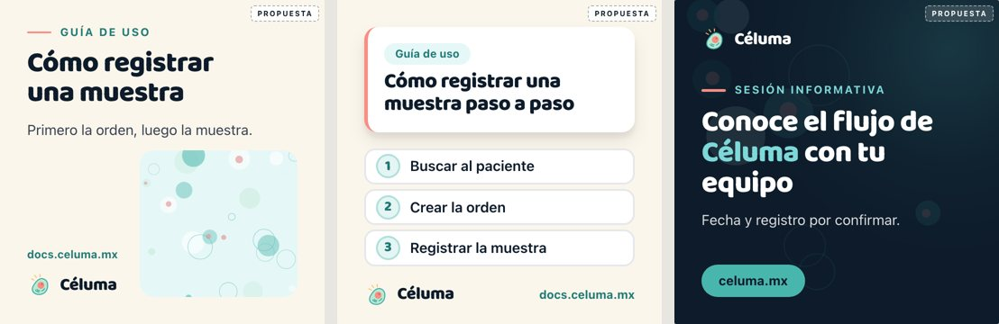

| | **A · Lámina clara** (recomendada) | **B · Ficha de producto** | **C · Luz nocturna** |
|---|---|---|---|
| Idea | Editorial sobre crema: eyebrow, título, texto y un módulo visual | Módulos de la app: tarjeta con borde salmón, chip y pasos numerados | Navy con titular grande, acento `#7dd8d9` y textura celular tenue |
| Mejor para | Anuncios, guías, consejos, bienvenida, contenido de marca | Tutoriales paso a paso y novedades de producto | Eventos, sesiones e hitos puntuales |
| Valores de marca | Claridad y aire (Notion: “espacio para respirar”) | Precisión; muestra el producto con honestidad | Luz (*lumen*), impacto |
| Proporción texto/imagen | Módulo 30–50 % del área útil y proporción entre 1:2 y 2:1 (verificado en 22 piezas, §0.3) | Texto en tarjeta 30 %, pasos 45 % (sin probar con contenido real) | Texto 40 %, textura de fondo (sin probar con contenido real) |
| Riesgos | Puede verse plana si el módulo visual es pobre | Puede sugerir funciones inexistentes si se inventan pantallas | Se parece a una estética *tech* genérica; menos cálida; costo alto en impresión |
| Producción | Baja: una plantilla, cambian texto y módulo | Media | Media |
| Formatos | 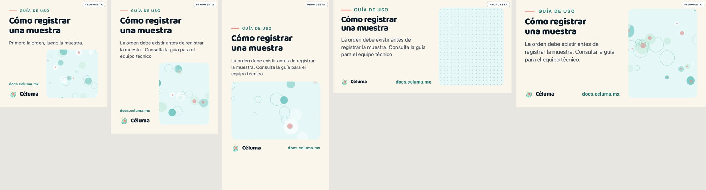 | 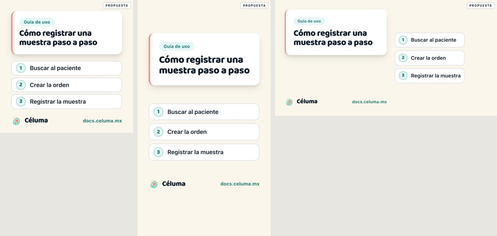 | 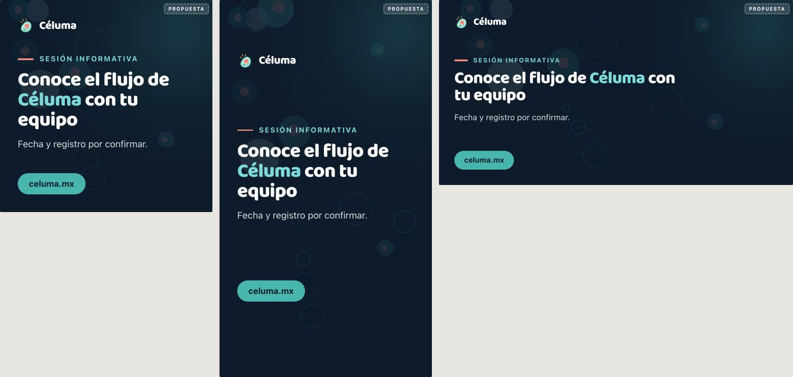 |

### 9.2 Dirección recomendada: A, con B como variante

**Justificación:**

1. **Es fiel a lo que ya existe.** Crema, Baloo y aire son lo que se ve en la app, el landing y los docs; no introduce un estilo nuevo.
2. **Expresa los valores.** La claridad y el “espacio para respirar” que pide la propuesta de Notion se traducen en un solo mensaje, un solo módulo y márgenes amplios.
3. **Aprovecha el frontend sin copiar pantallas.** La regla salmón del eyebrow deriva del borde del `PageHeader`: es el mismo principio de “marca en el borde, contenido limpio”.
4. **Es honesta.** No necesita capturas de producto ni cifras para funcionar, lo que reduce el riesgo de afirmaciones no verificadas.
5. **Escala a otros medios.** Funciona en 5 proporciones con las mismas reglas, se imprime bien porque es mayormente crema y texto, y se produce rápido.

**B** se usa dentro del mismo marco (márgenes, firma y zonas) cuando el contenido son pasos o una novedad del producto. **C** queda para eventos puntuales, sin convertirse en plantilla diaria.

### 9.3 Especificación de la Dirección A

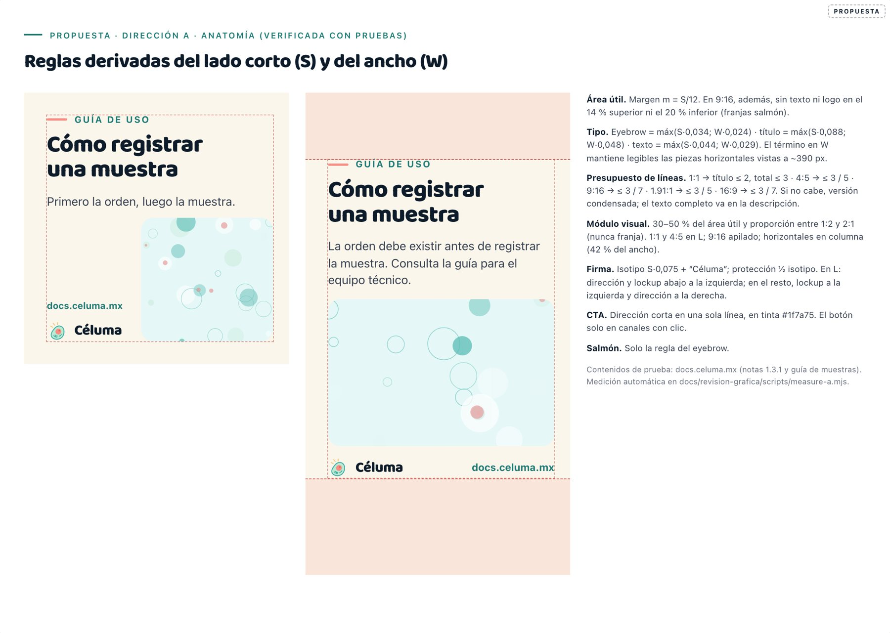

*Regla verificada con pruebas (§0.3). S = lado corto, W = ancho.*

| Elemento | Regla | A 1080 × 1080 |
|---|---|---|
| Área útil | Margen S / 12; en 9:16, además, 14 % superior y 20 % inferior libres | 90 px de margen |
| Eyebrow | máx(S × 0,034; W × 0,024); mayúsculas, interletrado 0,14 em, tinta `#1f7a75`, regla salmón | ≈ 37 px |
| Título | Baloo 2 · 800; máx(S × 0,088; W × 0,048); interlineado 1,04 | ≈ 95 px |
| Texto | Sistema · 400; máx(S × 0,044; W × 0,029); interlineado 1,4; `#374151` | ≈ 48 px |
| Presupuesto (líneas de título / total) | 1:1 ≤ 2 / 3 · 4:5 ≤ 3 / 5 · 9:16 ≤ 3 / 7 · 1.91:1 ≤ 3 / 5 · 16:9 ≤ 3 / 7; si no cabe, versión condensada | — |
| Módulo visual | 30–50 % del área útil; proporción entre 1:2 y 2:1; radio S × 0,044 | 31,7 % en 1:1 |
| Composición | 1:1 y 4:5 en L (módulo al 62 % y 60 % del ancho); 9:16 apilado; horizontales en columnas (módulo al 42 %) | — |
| Firma | Isotipo S × 0,075 + “Céluma”. En L: dirección y lockup abajo a la izquierda; en los demás, lockup a la izquierda y dirección a la derecha | isotipo ≈ 81 px |
| Protección del logo | ½ isotipo | ≈ 40 px |
| CTA | Dirección corta en una línea y en tinta teal; botón en píldora (teal + texto navy) solo en canales con clic | — |

**Cómo elegir el visual:**

- **Patrón:** mensajes de texto breves (avisos, recordatorios).
- **Ilustración:** temas de marca y portadas, siempre abstracta y sin rótulos técnicos.
- **Fotografía:** solo con banco aprobado y consentimiento (pendiente).
- **Captura de producto:** solo funciones publicadas y con datos ficticios, preferiblemente en la Dirección B.

**Adaptación a canales.** Las reglas no dependen de una red concreta: se definen por proporción (1:1, 4:5, 9:16, 1.91:1, 16:9). Cada canal toma la proporción que necesite. Las zonas del 9:16 cubren las interfaces superpuestas típicas de historias y videos cortos.

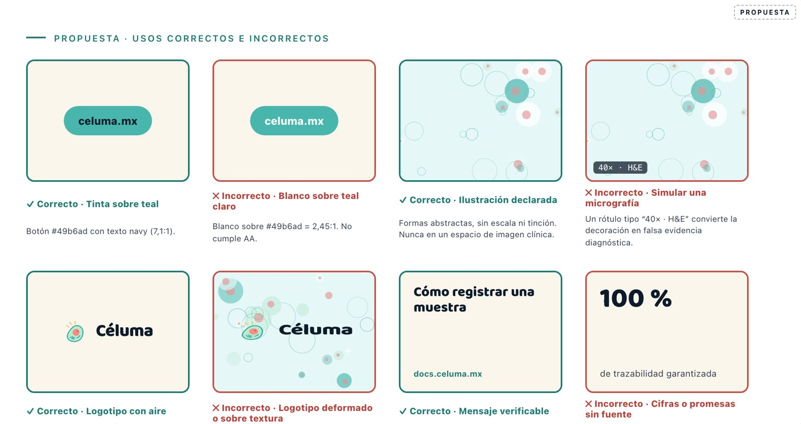

---

## 10. Catálogo de componentes

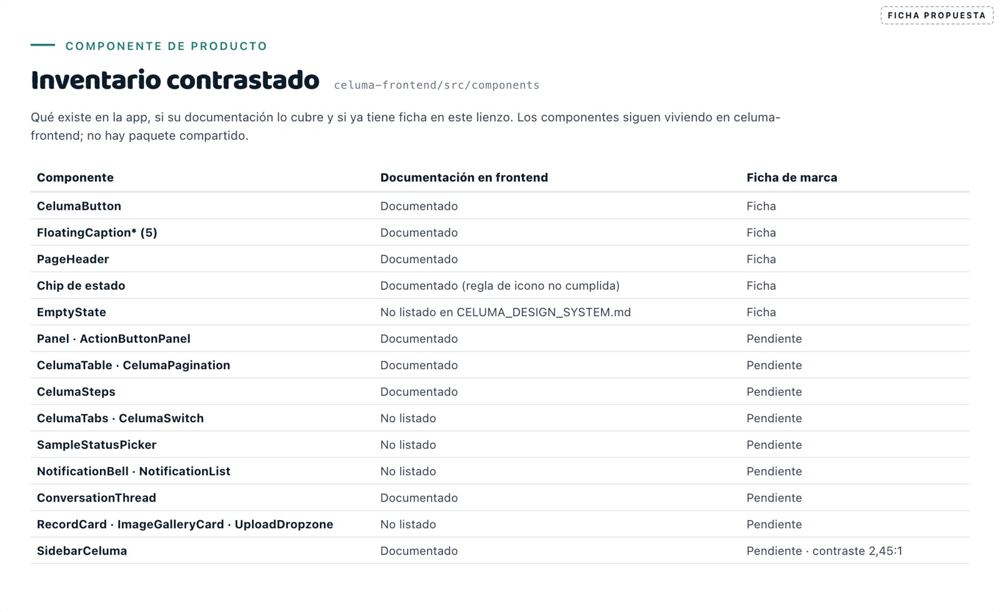

**Contraste con el frontend.** La app tiene unos 45 componentes en `src/components/ui`, más los de `collaboration`, `comments` y `auth`. Unos 20 no aparecen en `CELUMA_DESIGN_SYSTEM.md` (última edición: 2026-07-04), entre ellos `EmptyState`, `CelumaTabs`, `CelumaSwitch`, `SampleStatusPicker`, `RecordCard`, `NotificationList` y `UploadDropzone`. El lienzo anterior listaba 14 nombres.

**Fichas propuestas.** Son dibujos de referencia con valores tomados del código; no duplican la implementación.

| Ficha | Contenido | Hallazgo principal |
|---|---|---|
| `CelumaButton` | Anatomía, 3 pieles, 3 tamaños, 4 estados | Blanco sobre `#49b6ad` = 2,45:1. Propuesta: tinta navy (7,10:1), la misma regla que ya adoptó la marca |
| `PageHeader` | Anatomía y principio reutilizable | El borde salmón es el rasgo de identidad del producto; se traslada a la marca como regla, no como tarjeta completa |
| Chip de estado | Actual frente a propuesta | Aprobado y Publicado indistinguibles; tintas entre 2,07 y 3,44:1. Propuesta: tinta tono 700, icono por estado y relleno sólido solo para “Publicado” (el único estado entregado) |
| `FloatingCaptionInput` | Estados y reglas | El contorno en reposo (2,45:1) queda por debajo de 3:1 para límites de control |
| `EmptyState` | Principio *soft avatar* | Debe sustituir a los estados vacíos conceptuales del lienzo digital |

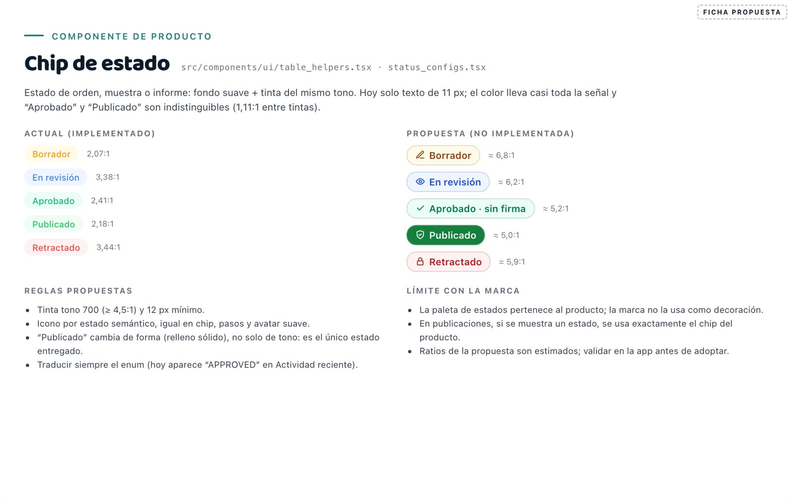

**Nota.** La etiqueta “Aprobado · sin firma” de la ficha es una propuesta de vocabulario de producto. Requiere la validación de quien responde por UI/UX (Laisha, según la página de bienvenida de Notion) y de producto.

---

## 11. Matriz de alineación bidireccional

| # | Origen → destino | Qué | Principio que lo hace reusable | Beneficio | Adaptación necesaria | Riesgo | Evidencia |
|---|---|---|---|---|---|---|---|
| M-01 | Marca → frontend | Texto navy sobre teal de identidad | La identidad (relleno) y la legibilidad (tinta) son roles distintos | Botones, sidebar y login pasan de 2,45:1 a 7,10:1 | Cambiar el color de texto en `button.tsx`, `sidebar_menu.tsx` y el login; revisar hover y disabled | Cambio visible en toda la app; validar con usuarios | `51-ficha-button`, `10-app-login` |
| M-02 | Marca → frontend | Teal de tinta `#1f7a75` para enlaces y etiquetas | Mismo motivo | Enlaces de paciente y etiquetas flotantes legibles | Sustituir `#49b6ad` como color de texto | Bajo | `10-app-informes`, `54-ficha-input` |
| M-03 | Frontend → marca | Borde o regla salmón | Una sola marca de identidad en el borde; contenido limpio en el centro | Firma visual compartida entre app y publicaciones | En publicaciones, regla corta; en impreso, regla fina | Que se use como texto o se confunda con error | `52-ficha-pageheader`, `30-propuesta-A` |
| M-04 | Frontend → marca | Geometría: radios 12–14, bordes de 2 px, píldora | Una forma suave consistente | Módulos de publicación coherentes con la app | En impreso, sin sombra | Bajo | `51-ficha-button` |
| M-05 | Frontend → marca | *Soft avatar* (tinta al 10 % + icono) | Mismo lenguaje en chip, paso y estado vacío | Iconografía de marca amable sin rellenos saturados | En publicaciones, solo con iconos de contorno | Bajo | `55-ficha-emptystate` |
| M-06 | Frontend → marca | Componentes reales (`EmptyState`, `NotificationList`, `PageHeader`) en el lienzo digital | Mostrar el producto que existe | La marca deja de mostrar una app que no existe | Fichas en lugar de maquetas conceptuales | Duplicar código; se evita con dibujos de referencia | `50-inventario` |
| M-07 | Marca + producto → frontend | Chip de estado con tinta 700, icono y forma distinta para “Publicado” | El estado no depende solo del color | Menos confusión entre aprobado y publicado | Cambiar `status_configs.tsx` y `renderStatusChip`; traducir los enums en actividad reciente | Cambio de semántica visual; validar con patólogos | `53-ficha-chip`, `10-app-inicio` |
| M-08 | Marca → landing y docs | Sustituir emoji por iconos de contorno | Un concepto = un icono | Aspecto más profesional y biomédico | Cuando se toque cada sección | Bajo | `13-landing`, `14-docs` |
| M-09 | Marca → landing y docs | Revisar absolutos y afirmaciones comerciales | Voz: clara y verificable | Menor riesgo legal | Validar con comercial y legal | Bajo | `Hero.tsx:166`, `CTA.tsx:161` |
| M-10 | Landing y docs → marca | Decidir el teal de CTA: `#0f8b8d` + blanco (4,12:1) o `#49b6ad` + navy (7,10:1) | Un solo tratamiento del rol “acción” | Coherencia entre superficies | Si se adopta el de marca, el landing cambia el color de texto del CTA | Cambio perceptible en el sitio público | `12-landing-hero` |
| M-11 | Marca → frontend y docs | Tratamiento consistente (tú) | Voz | Coherencia | Revisar el login (“¿Olvidó su contraseña?”) | Bajo | `11-moviles` |
| M-12 | Contrato → marca | Informes clínicos con huella de plataforma, nunca membrete de Céluma | ADR 0002 | Evita suplantar al laboratorio cliente | La papelería clínica del lienzo queda como concepto | — | `60-correccion-report-page` |
| M-13 | Marca → todos | No usar ilustración como micrografía | Separar decoración de evidencia | Claridad clínica | Espacio neutro `CelImageSlot` para imágenes de caso | — | `60-`, `61-`, `63-correccion` |

**Qué no se traslada:** la paleta de estados de la app como colores de marca; las sombras de tarjeta al impreso; el navy con campo celular como fondo por defecto; la densidad y los radios compactos (8/10) de la app a las publicaciones.

---

## 12. Cambios realizados en `celuma-brand-system`

**Correcciones de errores claros:**

| Archivo | Cambio |
|---|---|
| `components/documents.jsx` | El reporte clínico muestra un espacio neutro de “Imagen del caso” en lugar de un campo celular rotulado “40× · H&E”. La razón social inventada “Patología Digital S.A. de C.V.” pasa a “Razón social por confirmar”. |
| `components/web-patterns.jsx` | En la tarjeta del hero, espacio neutro en lugar de “40× · H&E”. Titular y texto sin absolutos (“en tiempo real”, “sin perder una sola muestra”). Encabezado de sección sin “100 % trazabilidad” ni “construido junto a…”, y ajustado para no desbordar. Etiquetas “Illustration” → “Ilustración”. |
| `components/slides.jsx` | La diapositiva de contenido ya no promete validación remota, láminas digitales ni visor 40×; usa funciones existentes (recepción, revisión, conversación), una ilustración rotulada como decorativa y un pie sin superposición. Las variaciones de la diapositiva de datos quedan como “Datos ilustrativos”. |
| `components/labops.jsx` | “INDRE” (institución real) → “Organismo ejemplo”. |
| `components/atoms.jsx` | Nuevo átomo `CelImageSlot`: espacio neutro para imágenes clínicas. |
| `canvases/digital.jsx` | Los subtítulos de las secciones heredadas las identifican como “Conceptos heredados · no aprobados”. |

**Adiciones (todas marcadas como propuesta):**

| Archivo | Contenido |
|---|---|
| `styles/celuma-tokens.css` | `--celuma-secondary` (salmón implementado en el frontend), `--celuma-secondary-soft` y `--celuma-secondary-ink` (propuesta) |
| `components/proposals-publicaciones.jsx` | Direcciones A, B y C; anatomía de A; usos correctos e incorrectos |
| `components/proposals-fundamentos.jsx` | Roles de color, escalas tipográficas, estado del logotipo, iconografía y voz |
| `components/proposals-componentes.jsx` | Inventario contrastado y fichas de `CelumaButton`, `PageHeader`, chip de estado, `FloatingCaptionInput` y `EmptyState` |
| `canvases/*.jsx`, `index.html` | Nuevas secciones “Propuesta · …” en Fundamentos, Material digital y Componentes |
| `docs/guia-de-publicaciones.md` | Guía para quien publica |
| `docs/revision-grafica/` | Capturas, scripts de captura y la referencia `Celuma_Isotipo_V2.png` |
| `docs/estado-de-piezas.md`, `README.md` | Filas y enlaces a las propuestas |

**Artboards nuevos (24, todos pendientes de aprobación):**

- *Material digital:* `pub-a-square`, `pub-a-portrait`, `pub-a-story`, `pub-a-link`, `pub-a-wide`, `pub-a-anatomia`, `pub-dodont`, `pub-b-square`, `pub-b-story`, `pub-b-link`, `pub-c-square`, `pub-c-story`, `pub-c-link`.
- *Fundamentos:* `fund-color`, `fund-tipo`, `fund-logo`, `fund-iconos`, `fund-voz`.
- *Componentes:* `ficha-inventario`, `ficha-button`, `ficha-header`, `ficha-chip`, `ficha-input`, `ficha-empty`.

**Segunda ronda:**

| Archivo | Cambio |
|---|---|
| `components/atoms.jsx` | Nuevo `CelExploration`: marca en esquina o en franja inferior |
| `canvases/papeleria.jsx` | Secciones y 34 artboards con “Exploración”; se añade `report-page-2`; etiquetas de laboratorio +16 px de alto |
| `components/documents.jsx` | Informe de ejemplo en portada y dos páginas (`ClinicalReportPage`, `ClinicalReportPage2`), con banda de ejemplo, datos ficticios y sin firma ni sello de validez |
| `components/proposals-publicaciones.jsx` | Dirección A: `PUB_CONTENTS` (3 contenidos comprobados y sus versiones condensadas), `PUB_A_RULE` (regla verificada), composición en L, guías de área útil y anatomía actualizada |
| `canvases/digital.jsx` | Nueva sección “Propuesta · Publicaciones A · Pruebas de contenido” (15 artboards); anatomía a 1180 × 840 |
| `README.md`, `docs/estado-de-piezas.md`, `docs/guia-de-publicaciones.md` | Estado único de la papelería; regla de la Dirección A |
| `docs/revision-grafica/` | Capturas 01, 30, 33, 34, 36, 37, 60, 65 y 66; `scripts/measure-a.mjs` y `grid.py`; `medicion-direccion-a.json` |

**Verificación de la segunda ronda:** 106 artboards renderizados sin errores de consola; 22 de 22 piezas de la Dirección A pasan la medición.

**Se conservaron como exploraciones:** las variantes A/B/C de papelería, el descriptor “Patología Digital” y “Sister system” (ambos pendientes de decisión). Se añadieron marcas de estado a la papelería y se reorganizó el informe de ejemplo; no se modificaron los archivos de `assets/`.

**Verificación por ronda:** 90 artboards en la primera; 106 después de la segunda, sin errores de consola (`docs/revision-grafica/scripts/capture-brand.mjs`). Los 22 casos de la Dirección A se midieron con `docs/revision-grafica/scripts/measure-a.mjs`; el resultado queda en `docs/revision-grafica/medicion-direccion-a.json`. Ambos scripts requieren un checkout hermano de `celuma-frontend` con sus dependencias instaladas y el servidor local del brand system en el puerto 5050. La primera ronda quedó en el commit `571cf60`; la segunda sigue sin commit, push ni publicación.

**Revisión de mantenimiento (2026-09-25):** se retiraron las rutas personales de los tres scripts de captura y medición; se comprobó su sintaxis y se ejecutó de nuevo la medición de la Dirección A. El JSON documentado se actualizó con 22 casos y 0 fallos. No se modificaron los artboards ni las capturas en esta revisión.

---

## 13. Limitaciones

- No pude copiar los PNG originales del logotipo y el banner de Notion. Los describo con mediciones hechas en el navegador y un enlace.
- La app se renderizó con datos simulados. Algunas pantallas complejas (detalle de orden, editor de informes) no se revisaron en vivo.
- Los contrastes de los chips propuestos están calculados sobre sus fondos, pero no se validaron en la app ni con usuarios.
- No hubo pruebas de impresión, lector de pantalla ni auditoría automática.
- Los criterios de fotografía no tienen material de referencia: no existe banco de imágenes.
- La Dirección A se probó con tres contenidos reales en español. Las Direcciones B y C no se probaron con contenido real y conservan la regla anterior (escala solo por S). No se probaron otros idiomas ni textos con palabras muy largas.
- La legibilidad en horizontales se estimó para una visualización a ~390 px de ancho; no se probó en dispositivos reales.
- El módulo visual usa la ilustración de campo celular o el patrón; la regla no se probó con fotografía.

---

## 14. Hechos, interpretaciones y preferencias

- **Hechos:** los valores de color, los contrastes, que el isotipo es idéntico al V2, las diferencias de wordmark, las afirmaciones encontradas y los componentes existentes.
- **Interpretaciones:** que “Patología Digital” sugiere escaneo de laminillas; que “Sister system” alude a Eunoia; que la confusión Aprobado/Publicado es un riesgo clínico.
- **Preferencias estéticas (explicitadas):** que el crema domine y el navy puntúe; que la Dirección C resulte menos cálida; que el módulo visual de A funcione mejor con campo celular que con patrón en formatos cuadrados.

---

## 15. Decisiones que Rafael debe validar

| ID | Decisión | Opciones | Recomendación |
|---|---|---|---|
| **D-1** | Wordmark oficial | (a) Baloo 2 en uso · (b) sans geométrica de Notion V2 · (c) redibujar un wordmark propio | (a) como base mientras se encarga un maestro vectorial; (b) implicaría cambiar las cuatro superficies |
| **D-2** | Maestro vectorial del isotipo y el lockup | Encargarlo a un diseñador o vectorizar a partir del V2 con revisión | Encargar; no redibujar sin control |
| **D-3** | Tratamiento del CTA (M-10) | `#49b6ad` + navy en todo · mantener `#0f8b8d` + blanco en el landing | Unificar en `#49b6ad` + navy |
| **D-4** | Texto sobre teal en la app (M-01) | Navy · relleno `#1f7a75` con blanco | Navy (conserva el color de identidad) |
| **D-5** | Salmón como acento de marca | Sí, con reglas · solo producto | Sí, con reglas (§8) |
| **D-6** | Dirección de publicaciones | A · B · C · combinación | A base + B variante; C solo eventos |
| **D-7** | Narrativa y origen del nombre | *lumen* · *Luminis* | *lumen* (§5) |
| **D-8** | Descriptor | “Patología Digital” · “Gestión para laboratorios de anatomía patológica” · sin descriptor | No usar “Patología Digital” mientras no haya digitalización de laminillas |
| **D-9** | “Sister system” / Eunoia | Mantener y explicar · retirar | Confirmar el significado antes de publicar |
| **D-10** | Chip de estado y vocabulario (M-07) | Tinta 700 + icono · además forma distinta para “Publicado” | Ambos, validados con patología (con Laisha como responsable de UI/UX) |
| **D-11** | Iconografía | CelIcon en marca + equivalencias Ant Design · adoptar una sola librería | Equivalencias; sustituir emoji progresivamente |
| **D-12** | Tipografía de texto para impresos y piezas exportadas | Elegir una sans con licencia (p. ej. Inter, que ya menciona Notion) | Definir antes de cualquier impreso |
| **D-13** | Afirmaciones del landing (M-09) | Validar · suavizar | Validar con comercial y legal |
| **D-14** | Papelería | Elegir una variante por pieza | Posponer hasta cerrar D-1, D-2 y D-12 |
| **D-15** | Cuándo extraer el paquete de componentes | Tras estabilizar las fichas y los tokens | Primero los tokens (JSON), luego los componentes |

---

## 16. Próximos pasos sugeridos

1. Validar D-1 a D-6 con los artboards del lienzo a la vista.
2. Con A aprobada, preparar las plantillas editables de las 5 proporciones y cerrar la guía de publicaciones.
3. Pedir el maestro vectorial y preparar la tabla CMYK/Pantone.
4. Abrir en `celuma-frontend` los cambios M-01, M-02 y M-07 como trabajo propio, con pruebas visuales.
5. Completar las fichas pendientes: `Panel` y `ActionButtonPanel`, `CelumaTable`, `CelumaSteps`, `SampleStatusPicker` y `SidebarCeluma`.
